# Workflow Diagrams - Frontend

Visual diagrams for the TVSM-MHI Frontend development workflows and processes.

## 🔄 Pre-commit Workflow

```mermaid
graph TD
    A[Developer makes changes] --> B[git add .]
    B --> C[git commit -m "message"]
    C --> D[Pre-commit Hook Triggered]
    D --> E[ESLint --fix]
    E --> F{ESLint passes?}
    F -->|No| G[❌ Commit blocked - Fix lint errors]
    F -->|Yes| H[Prettier --write]
    H --> I{Prettier success?}
    I -->|No| J[❌ Commit blocked - Fix formatting]
    I -->|Yes| K[ng test --watch=false]
    K --> L{Tests pass?}
    L -->|No| M[❌ Commit blocked - Fix failing tests]
    L -->|Yes| N[✅ Commit allowed]
    N --> O[Commit-msg Hook]
    O --> P{Valid commit message?}
    P -->|No| Q[❌ Commit blocked - Fix message format]
    P -->|Yes| R[✅ Commit successful]
    
    G --> S[Fix code and retry]
    J --> S
    M --> S
    Q --> T[Fix message and retry]
    S --> C
    T --> C
```

## 📝 Commit Message Validation

```mermaid
graph TD
    A[Commit Message] --> B{Format: type(scope): description}
    B -->|Valid| C[Check Type]
    B -->|Invalid| D[❌ Rejected - Invalid format]
    
    C --> E{Type in allowed list?}
    E -->|Yes| F[Check Scope]
    E -->|No| G[❌ Rejected - Invalid type]
    
    F --> H{Scope appropriate?}
    H -->|Yes| I[Check Description]
    H -->|No| J[❌ Rejected - Invalid scope]
    
    I --> K{Description clear and concise?}
    K -->|Yes| L[✅ Commit accepted]
    K -->|No| M[❌ Rejected - Poor description]
    
    D --> N[Show help: docs/COMMIT_GUIDELINES.md]
    G --> N
    J --> N
    M --> N
```

## 🏗️ Project Architecture


## 🧪 Test Execution Flow


## 🔐 Authentication Flow


## 📦 Build Process


## 🔧 Development Server Flow


## 📋 Code Quality Pipeline

```mermaid
graph TD
    A[Code Changes] --> B[ESLint Check]
    B --> C{ESLint Issues?}
    C -->|Yes| D[Auto-fix Issues]
    C -->|No| E[Prettier Formatting]
    
    D --> F{All Issues Fixed?}
    F -->|No| G[❌ Manual Fix Required]
    F -->|Yes| E
    
    E --> H[Format Code]
    H --> I[Unit Tests]
    I --> J{All Tests Pass?}
    
    J -->|No| K[❌ Fix Failing Tests]
    J -->|Yes| L[Commit Message Check]
    
    L --> M{Valid Format?}
    M -->|No| N[❌ Fix Commit Message]
    M -->|Yes| O[✅ Code Quality Passed]
    
    G --> P[Developer fixes issues]
    K --> P
    N --> Q[Developer fixes message]
    P --> A
    Q --> A
```



## 🚀 Deployment Pipeline

```mermaid
graph TD
    A[Code Committed] --> B[Pre-commit Hooks Pass]
    B --> C[Push to Repository]
    C --> D[CI/CD Pipeline Triggered]
    
    D --> E[Install Dependencies]
    E --> F[Run Linting]
    F --> G[Run Tests]
    G --> H[Build Application]
    
    H --> I{Build Successful?}
    I -->|No| J[❌ Deployment Failed]
    I -->|Yes| K[Deploy to Staging]
    
    K --> L[Run E2E Tests]
    L --> M{E2E Tests Pass?}
    M -->|No| N[❌ Rollback Deployment]
    M -->|Yes| O[Deploy to Production]
    
    O --> P[✅ Deployment Complete]
    
    J --> Q[Fix Issues and Retry]
    N --> Q
    Q --> A
```



## 📊 Test Coverage Flow


## 🔄 Git Workflow

```mermaid
graph TD
    A[Developer starts work] --> B[Create feature branch]
    B --> C[Make changes]
    C --> D[Stage changes: git add .]
    D --> E[Commit: git commit -m "message"]
    E --> F[Pre-commit hooks run]
    F --> G{Hooks pass?}
    G -->|No| H[Fix issues and retry]
    G -->|Yes| I[Commit-msg validation]
    I --> J{Message valid?}
    J -->|No| K[Fix message and retry]
    J -->|Yes| L[Commit successful]
    
    L --> M[Push to remote]
    M --> N[Create Pull Request]
    N --> O[Code Review]
    O --> P{Approved?}
    P -->|No| Q[Address feedback]
    P -->|Yes| R[Merge to main]
    
    H --> C
    K --> E
    Q --> C
    R --> S[Deploy to production]
```

## 📈 Performance Monitoring


